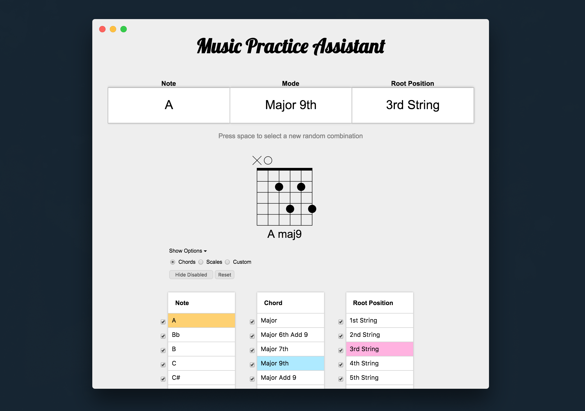

# Guitar Practice Assistant

An electron-based virtual training tool for guitarists.



## To use
```
# clone this repository
git clone https://github.com/jdansev/Guitar-Practice-Assistant
# go into the directory
cd Guitar-Practice-Assistant
# install the dependencies
npm install
# run it
npm start
```

## To package as a standalone app
```
# output to release-builds folder
electron-packager . --overwrite --platform=darwin --arch=x64 --prune=true --out=release-builds
```